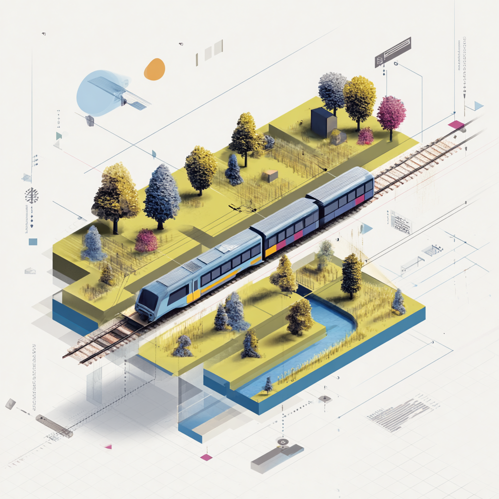

  

# Trains to Green

A web app that helps Londoners discover rail-accessible day hikes. Compare stations by travel time, hiking quality, and nearby scenery — no car needed.

**[View the case study](https://www.niczap.design/trains-to-green)**

## What it does

- Compare train stations by travel time from London and the quality of nearby hikes
- See which stations can be walked to from which in a day's hiking
- Be inspired by beautiful rural photography around each station

## Built with

React, TypeScript, Tailwind CSS, shadcn/ui, Mapbox GL
